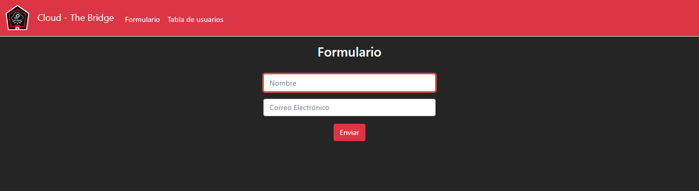
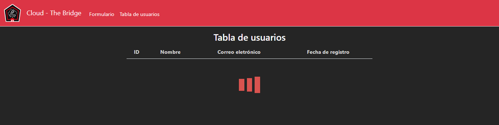
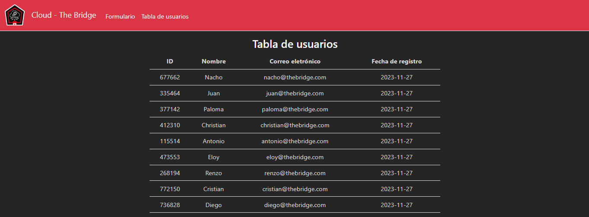
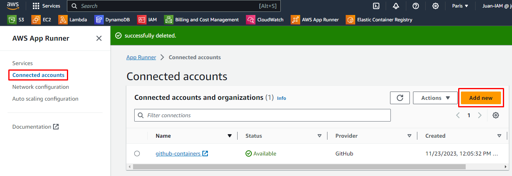

# Ejercicio final Terraform

## Parte 0 - Terraform cloud y credenciales AWS:

Comenzamos por preparar nuestro backend de terraform en *terraform cloud* para trabajar de forma segura sin perder los ficheros *tfstate*. Empezamos creando un nuevo proyecto llamado *Juan-EjFinal-terraform*, y lanzamos el comando `terraform login` para dar las credenciales al proyecto durante 90 dias.


Una vez creado, copiamos el bloque de código a nuestro main.tf y ejecutamos `terraform init` para inicializar el proyecto, y `terraform apply` para lanzar nuestra primera versión. 


El siguiente paso para preparar nuestro proyecto es darle a *terraform cloud* las credenciales necesarias para acceder a los recursos de AWS. Para eso, crearemos una cuenta IAM en AWS que solo tenga los permisos esenciales. Los permisos de Amazon que podemos asignarle directamente son:

- AmazonDynamoDBFullAccess
- AmazonS3FullAccess
- AWSLambda_FullAccess

Sin embargo, necesitamos crear un permiso para la creación de un rol, que llamaremos TERRAFORMcreateRole. Para ello le permitimos a este nuevo rol las siguientes acciones:

- iam:CreateRole
- iam:ListPolicies
- iam:AttachRolePolicy
- iam:DeleteRole
- iam:ListInstanceProfilesForRole
- iam:DetachRolePolicy


Una vez creada la cuenta IAM, iremos a sus *security credentials* y crearemos claves de acceso. Estas cláves generadas se copiarán como variables de entorno en nuestro proyecto de terraform cloud.


Las variables que crearemos en terraform cloud son *AWS_ACCESS_KEY_ID* y *AWS_SECRET_ACCESS_KEY*. Con esto ya tenemos el proyecto configurado.


## Parte 1 - Desplegar una lambda:

>Este desarrollo es para una empresa que trabaja con datos y tiene la necesidad de que cada vez que se crea un fichero Json en un bucket de almacenamiento de S3, se lance una función lambda que guarde el contenido de ese fichero en una base de datos montada en DynamoDB. 
>
>
>
>El objetivo es utilizar terraform para crear un bucket en S3 donde se subirán los .json, una base de datos en dynamoDB y una función lambda que lea ese .json e inserte los datos en la base de datos. 
>
>La estructura del Json que reciben es la siguiente:
```json
{
    "ID": 123456,
    "Nombre": "Juan Pérez",
    "Correo electrónico": "juan.perez@example.com",
    "Fecha de registro": "2022-01-01T10:00:00Z"
}
```

## Resolución

Nuestro proyecto se hará con módulos, los cuales se componen de tres ficheros cada uno:

- **variables-modulo.tf**: contiene las variables que modifican los recursos.
- **output-modulo.tf**: contiene la configuración de los mensajes de salida del terraform.
- **main-modulo.tf**: contiene la configuración de los recursos.

### Base de datos en DynamoDB:

El primer módulo será el de la creación de una base de datos en *dynamoDB*, la cual tendrá la columna ID como columna principal (*hash-key*):

**main-dynamoDB.tf**:

```tf
resource "aws_dynamodb_table" "dynamoDB" {
  name         = var.nombre-dynamo              # Nombre de la tabla
  billing_mode = "PAY_PER_REQUEST"
  hash_key     = var.hash-key.name              # El identificador de la tabla
  range_key    = var.range-key.name

  attribute {                                   # Definimos la columna principal. 
    name = var.hash-key.name
    type = var.hash-key.type
  }
}
```

**variables-dynamoDB.tf**:

```tf
variable "nombre-dynamo" {
  description = "nombre de la base de datos en dynamoDb"
  type        = string
}

variable "hash-key" {
  description = "Columna principal de la dynamoDB"
  type        = map(string)
}
```

### Bucket en S3:

El siguiente módulo será el de la creación de un bucket en S3, e incluirá un ciclo de vida de un dia, ya que el almacenamiento es para almacenar ficheros *json* temporales, logrando así una pequeña optimización en el coste del recurso:

**main-S3.tf**:

```
resource "aws_s3_bucket" "bucketS3" {
  bucket = var.nombre-bucket 			# Referencia al nombre del bucket
  force_destroy = true 					# Permitimos porque los ficheros en este proyecto son temporales

    tags = {
    Name        = var.nombre-bucket
  }
}

resource "aws_s3_bucket_lifecycle_configuration" "ciclo-vida-S3" {
  bucket = aws_s3_bucket.bucketS3.id
  rule {
    status = "Enabled"
    id     = "expire_all_files"			# Elimina todos los ficheros
    expiration {
        days = 1						# edad de los ficheros cuando se eliminan
    }
  }
}
```

**variables-S3.tf**:

```tf
variable "nombre-bucket" {
  description = "Nombre del bucket de AWS"
  type = string
}
```

### Lambda:

El primer obstáculo con el que nos encontramos a la hora de crear la lambda son los permisos. Para lograr darle los permisos necesarios, debemos crear un rol de servicio que permita a la lambda el acceso de lectura y escritura a la base de datos y el permiso de lectura al bucket. Los permisos necesarios son *AmazonDynamoDBFullAccess* y *AmazonS3ReadOnlyAccess*. Para ello empezamos con el recurso siguiente:

**main-lambda.tf**:

```tf
resource "aws_iam_role" "lambda_role" {
  assume_role_policy = jsonencode({
    "Version": "2012-10-17",
    "Statement": [
        {
            "Effect": "Allow",
            "Principal": {
                "Service": "lambda.amazonaws.com"
            },
            "Action": "sts:AssumeRole"
        }
    ]
})

managed_policy_arns  = var.permisos
}
```

**variables-lambda.tf**:

```tf
variable "permisos" {
  description = "Permisos asociados a la lambda"
  type        = set(string)
}
```

Una vez creado el rol para la lambda, procedemos a crear la lambda en si. El primer paso es crear un fichero *main.py* con el código fuente de la lambda, y un *requirements.txt* para que la lambda instale las librerias necesarias:

**requirements.txt**:

```txt
boto3==1.28.62
urllib3==2.0.6
```

**main.py**:

```python
# Librerías necesarias
import json
import boto3
import urllib.parse

s3 = boto3.client('s3')
dynamodb = boto3.resource('dynamodb')
table = dynamodb.Table('DBjuan-EjFinal-terraform')
bucket_name = 's3terraformejfinal'

def lambda_handler(event, _):
    # Comprueba si el evento proviene de S3
    if 'Records' in event and 's3' in event['Records'][0]:
        # El evento es un archivo nuevo en S3
        file_key = urllib.parse.unquote_plus(event['Records'][0]['s3']['object']['key'])
        response = s3.get_object(Bucket=bucket_name, Key=file_key)
        content = response['Body'].read().decode('utf-8')
        data = json.loads(content)

        # Inserta los datos en la tabla DynamoDB
        response = table.put_item(Item=data)

        return {
            'statusCode': 200,
            'body': json.dumps('Datos insertados en DynamoDB')
        }
    else:
        return {
            'statusCode': 400,
            'body': json.dumps('Evento no válido')
        }
```

Estos ficheros los guardaremos en una carpeta llamada *src*, en la carpeta del módulo de la lambda, de esta forma, terraform podrá crear un zip con el código fuente y utilizarlo para crear la lambda:

**main-lambda.tf**:

```tf
data "archive_file" "zip_the_python_code" {
type        = "zip"
source_dir  = "${path.module}/src/"
output_path = "${path.module}/src/src.zip"
}

resource "aws_lambda_function" "lambda" {
  filename      = "${path.module}/src/src.zip"
  function_name = var.nombre-lambda
  role          = aws_iam_role.lambda_role.arn
  handler       = var.handler-lambda

  runtime = var.runtime-lambda
}
```

**variables-lambda.tf**:

```tf
variable "nombre-lambda" {
  description = "nombre de la lambda"
  type        = string
}

variable "handler-lambda" {
  description = "Función dentro del codigo fuente que se ejecutará. Tiene el formato *origen.función* (ejemplo: *main.ejemplo*)"
  type = string
}

variable "runtime-lambda" {
  description = "Lenguaje de la función"
  type        = string
}

variable "codigo-fuente" {
  description = "Código fuente de la lambda en formato zip"
  type = string
}
```

### Fichero raiz y trigger:

Hasta este punto hemos logrado crear tres módulos independientes y reutilizables, sin embargo, necesitamos darle valor a las variables y ejecutarlos en conjunto para lograr una arquitectura funcional. Para lograr este fin, crearemos un fichero terraform en la carpeta raiz llamado *main.tf* que llamará a nuestros módulos y les proporcionará parámetros para sus variables.

Empezamos por los datos de AWS IAM que necesitamos importar y las variables que le vamos a proporcionar a los módulos:

**main.tf**:
```tf
locals {
  
  region                   = "eu-west-3" # Paris
  
  nombre-bucket            = "s3terraformejfinal"

  nombre-dynamo            = "DBjuan-EjFinal-terraform"
  columna-principal-dynamo = { name="ID", type="N" }
  
  nombre-lambda            = "copia-de-s3-a-dynamodb"
  permisos-para-lambda     = [ "AmazonDynamoDBFullAccess", "AmazonS3ReadOnlyAccess" ]
  nombre-app               = "main"
  funcion-en-app           = "lambda_handler"
  runtime-lambda           = "python3.12"
  codigo-fuente            = "src.zip" # en formato zip
}

data "aws_iam_policy" "permisos" {
  count = length(local.permisos-para-lambda)

  name = local.permisos-para-lambda[count.index]
}
```

Seguidamente, configuramos el proveedor y empezamos a llamar los módulos:

**main.tf**:

```tf
provider "aws" {
  region = local.region
}

module "dynamoDB" {
  source        = "./modules/dynamoDB"
  nombre-dynamo = local.nombre-dynamo
  hash-key      = local.columna-principal-dynamo
}

module "bucketS3" {
  source        = "./modules/bucketS3"
  nombre-bucket = local.nombre-bucket
}

module "lambda" {
  source         = "./modules/lambda"
  nombre-lambda  = local.nombre-lambda
  permisos       = [ for permiso in data.aws_iam_policy.permisos : permiso.arn ]
  handler-lambda = "${local.nombre-app}.${local.funcion-en-app}"
  runtime-lambda = local.runtime-lambda
  codigo-fuente  = local.codigo-fuente
}
```

Llegados a este punto hemos logrado que terraform nos cree tres recursos en AWS, sin embargo, la lambda no tiene ningun activador para que se ejecute. Para ello agregamos a nuestro fichero raiz un recurso para permitir acceso del bucket a la lambda y un recurso para que el bucket notifique a la lambda que recibió un nuevo fichero:

**main.tf**:

```tf
resource "aws_lambda_permission" "permitir_bucket" {
  statement_id  = "AllowExecutionFromS3Bucket"
  action        = "lambda:InvokeFunction"
  function_name = module.lambda.arn-lambda
  principal     = "s3.amazonaws.com"
  source_arn    = module.bucketS3.info-bucket.arn
}

resource "aws_s3_bucket_notification" "lambda-trigger" {
  bucket                = module.bucketS3.info-bucket.id

  lambda_function {
    lambda_function_arn = module.lambda.arn-lambda
    events              = ["s3:ObjectCreated:*"]
  }

  depends_on = [
    aws_lambda_permission.permitir_bucket
  ]
}
```

Para completar los recursos anteriores, necesitamos información de nuestros recursos generados anteriormente. Para que nos devuelvan la información deseada vamos a crear dos ficheros *output.tf* para el bucket y para la lambda:

**output-S3.tf**:

```tf
output "info-bucket" {
  value = aws_s3_bucket.bucketS3
}
```

**output-lambda.tf**:

```tf
output "arn-lambda" {
  value = aws_lambda_function.lambda.arn
}
```

## Parte 2 -  Formulario web y consulta de datos:

>El siguiente requerimiento de la empresa es la realización de un formulario web, para no tener que rellenar a mano los json, y una página que muestre toda su base de datos de usuario, de esta manera puedan tener un inventario sólido de usuarios y guardarlos en S3. 
>
>Para ello se plantean crear una aplicación web en el lenguaje que decida el proveedor que levante un formulario y que al guardar genere un fichero json en S3. Cuando se genere este fichero, al crearse en S3 se disparará automáticamente la función que dispare el primer requerimiento y a su vez quedará actualizado en el seguimiento de usuarios. 
>
>En el futuro tienen intención de ampliar la página web para incorporar una página de inicio y otras funcionalidades, por lo tanto solicitan una solución de implementación y despliegue continuo con apprunner.

## La web:

La página web que utilizaremos es la siguiente:

Formulario:



Pantalla de carga:



Tabla de datos:



Esta página tiene 4 ficheros html y un fichero css, que son poco informativos, y el siguiente fichero de python para el backend:

**app.py**:

```python
from flask import Flask, render_template, request, redirect, flash
import boto3
import json
import random
import datetime
import time


today = datetime.date.today().strftime('%Y-%m-%d')
todayUTC = int(time.time())

nombre_bucket = "s3terraformejfinal"
nombre_dynamoDB = "DBjuan-EjFinal-terraform"

# Crea una aplicación de Flask
app = Flask(__name__)
app.config['SECRET_KEY'] = '000000'


@app.route("/", methods=["GET", "POST"])
def index():
    """
    Definición: Endpoint para la página de inicio de la web. Contiene un formulario.

    Form: Nombre - Nombre insertado por el usuario.
    Form: Correo electrónico - email insertado por el usuario.

    Return: index.html
    """

    if request.method == "GET":
        return render_template("index.html")

    else:
        # Creamos un cliente de boto3 para acceder a S3
        s3 = boto3.client('s3', region_name="eu-west-3")

        # Comprobamos que se han introducido los datos
        nombre = request.form.get("nombre")
        if len(nombre) == 0:
            flash("¡Introduce un nombre!")
            return render_template("index.html")
        
        email = request.form.get("email")
        if len(email) == 0:
            flash("¡Introduce un correo electrónico!")
            return render_template("index.html", nom=nombre)

        # Comprobamos que el usuario no existe en la base de datos
        dynamodb = boto3.resource('dynamodb', region_name="eu-west-3")
        tabla_usuarios = dynamodb.Table(nombre_dynamoDB)
        response = tabla_usuarios.scan()
        docs = response['Items']

        docs_dict = []
        for doc in docs:
            docs_dict.append(doc)

        existe = False

        for d in docs_dict:
            if d['email'] == email:
                existe = True

        if existe == True:
            flash("¡Este correo electrónico ya ha sido registrado!")
            return render_template("index.html", nom=nombre, mail=email)
        else:
            # Creamos un diccionario con los datos del usuario
            usuario = {
                'ID': random.randint(100000, 999999),
                'nombre': nombre,       # Dato procedente de la web
                'email': email,         # Dato procedente de la web
                'registro': today       # Dato procedente de la variable creada arriba
            }

            try:
                # Guardamos los datos del usuario en un archivo JSON en cloud storage                
                s3.put_object(Bucket=nombre_bucket, Key=f'usuarios{todayUTC}.json', Body=json.dumps(usuario))
                return redirect("/loading")
            except:
                flash("¡Ha ocurrido un error! No se han almacenado los datos.")
                return render_template("index.html")

@app.route("/loading")
def loading():
    """
    Definición: Endpoint para la página de espera mientras carga la tabla.

    Return: loading.html
    """
    return render_template("loading.html")


@app.route("/data")
def data():
    """
    Definición: Endpoint para la página de la tabla de usuarios.

    Items - diccionario de datos extraídos de la base de datos

    return: data.html
    """

    # Configurar conexión con dynamoDB
    dynamodb = boto3.resource('dynamodb', region_name="eu-west-3")
    tabla_usuarios = dynamodb.Table(nombre_dynamoDB)

    # Obtener los elementos de la tabla
    response = tabla_usuarios.scan()
    items = response['Items']
    return render_template("data.html", items=items)


if __name__ == '__main__':
    # Ejecuta la aplicación
    app.run(host="0.0.0.0", port=5000, debug=False)
```

## App Runner:

Si contenerizamos los ficheros anteriores y los desplegamos manualmente a través de apprunner, habremos logrado una página web funcional. Sin embargo, para lograr una implementación y un despliegue contínuos vamos a necesitar un repositorio de github conectado a apprunner. De este modo, cada vez que github reciba una actualización, apprunner volverá a desplegar la web con los ficheros actualizados en github. Para lograrlo primero necesitamos crear un nuevo repositorio y posteriormente una nueva conexión con github desde apprunner:



Seguimos los pasos y nos conectamos al repositorio que acabamos de crear. Una vez completado la conexión con github, debemos agregarle nuevos permisos a nuestro usuario IAM de terraform cloud para que pueda utilizar apprunner. En primer lugar agregaremos la política *AWSAppRunnerFullAccess* y luego modificaremos la política que creamos anteriormente para agregarle los permisos *iam:PassRole* y *iam:UpdateAssumeRolePolicy*.

Hecho esto, podemos empezar a desarrollar nuestro módulo de apprunner. Para empezar, tenemos que crear un rol para el recurso que tenga permisos de escritura en el bucket y permisos de lectura en la base de datos:

**main-apprunner.tf**:

```tf
resource "aws_iam_role" "rol-apprunner" {
    name = "rol-${var.nombre-apprunner}"

    managed_policy_arns  = var.policies

    assume_role_policy = jsonencode({
    "Version": "2012-10-17",
    "Statement": [
        {
            "Effect": "Allow",
            "Action": [
                "sts:AssumeRole"
            ],
            "Principal": {
                "Service": [
                    "tasks.apprunner.amazonaws.com"
                ]
            }
        }
    ]
})
}
```

Seguidamente creamos el recurso apprunner:

**main-apprunner.tf**:

```tf
resource "aws_apprunner_service" "apprunner" {
  service_name = var.nombre-apprunner

  source_configuration {
    authentication_configuration {
      connection_arn = var.connection_arn_github
    }
    code_repository {
      code_configuration {
        code_configuration_values {
          build_command = var.build_command
          port          = var.port
          runtime       = var.runtime
          start_command = var.start_command
        }
        configuration_source = "API"
      }
      repository_url = var.repository_url
      source_code_version {
        type  = var.source_code_version.type
        value = var.source_code_version.value
      }
    }
  }

  instance_configuration {
    cpu = var.conf_instance.cpu
    memory = var.conf_instance.memory

    instance_role_arn = aws_iam_role.rol-apprunner.arn
  }

  network_configuration {
    egress_configuration {
      egress_type       = "DEFAULT"
    }
  }

  tags = {
    Name = var.nombre-apprunner
  }
}
```

Las variables del módulo se definirán de la siguiente manera:

**variables-apprunner.tf**:

```tf
variable "nombre-apprunner" {
    description = "Nombre para el servicio de apprunner"
    type = string
}

variable "connection_arn_github" {
    description = "ARN de la conexión entre github y AppRunner. Imprescindible para conexion con repositorios github"
    type = string
}

variable "build_command" {
    description = "Comando de AppRunner que se ejecuta para crear la aplicación"
    type = string
}

variable "port" {
    description = "Puerto que escucha su aplicación en el contenedor"
    type = string
}

variable "runtime" {
    description = "Tipo de entorno de ejecución para crear y ejecutar un servicio App Runner"
    type = string
}

variable "start_command" {
    description = "Comando de AppRunner que se ejecuta para iniciar la aplicación"
    type = string
}

variable "repository_url" {
    description = "Ubicación del repositorio que contiene el código fuente"
    type = string
}

variable "source_code_version" {
    description = "bloque admite los siguientes argumentos: type: Tipo de identificador. Valores válidos: BRANCH; value: rama que se utiliza"
    type = map(string)
}

variable "conf_instance" {
    description = "configuración de las instancias creadas. cpu = numero de procesadores, memory = memoria RAM en GB"
    type = map(string)
}

variable "policies" {
    description = "Políticas de permisos para la instancia de apprunner"
    type = list(string)
}
```

Finalmente, en nuestro terraform raiz, definiremos valores para las variables, importaremos los datos de los permisos para el rol y crearemos el módulo:

**main.tf**:

```tf
locals {
  nombre-apprunner      = "despliegue-apprunner"
  connection_arn_github = "arn:aws:apprunner:eu-west-3:757967241514:connection/github-containers/8a91462f6503486ca4558e011a7700e6"
  build_command         = "pip install -r web/requirements.txt"
  puerto                = "5000"
  runtime               = "PYTHON_3"
  start_command         = "python web/app.py"
  url_repositorio       = "https://github.com/juanadevesat/juan-EjFinal-terraform"
  source_code_version   = {type = "BRANCH", value = "main"}
  conf_instancia        = {cpu = "1 vCPU", memory = "2 GB"}
  politicas_instancia    = ["AmazonDynamoDBReadOnlyAccess", "AmazonS3FullAccess"]
}

data "aws_iam_policy" "politicas-apprunner" {
  count = length(local.politicas_instancia)

  name = local.politicas_instancia[count.index]
}

module "apprunner" {
  source = "./modules/apprunner"

  nombre-apprunner      = local.nombre-apprunner
  connection_arn_github = local.connection_arn_github
  build_command         = local.build_command
  port                  = local.puerto
  runtime               = local.runtime
  start_command         = local.start_command
  repository_url        = local.url_repositorio
  source_code_version   = local.source_code_version
  conf_instance         = local.conf_instancia
  policies              = [ for politica in data.aws_iam_policy.politicas-apprunner : politica.arn ]
}
```